# 实验五——Web服务器

## 实验环境
+ Ubuntu 18.04
+ VirtualBox
+ putty
+ LEMP
+ Nginx
+ VeryNginx
+ WordPress4.7
+ DVWA

## 实验要求
- [x] 基本要求   
- [x] 安全加固要求   
- [x] VeryNginx配置要求

## 实验过程
### 安装Nginx
```
sudo apt-get update
sudo apt install nginx
```
---
### 安装VeryNginx

+ Nginx安装后会自动开启，并占用80端口，所以先关闭  
`sudo nginx -s stop`

+ 安装相关依赖包
	```
	sudo apt install libssl1.0-dev
	apt install libpcre3-dev
	sudo apt install zlib1g-dev
	sudo apt install gcc make
	```
+ 安装VeryNginx

	```
	#git到本地
	git clone https://github.com/alexazhou/VeryNginx.git
	cd veryneginx/

	sudo python3 install.py install
	```
+ 修改配置文件/opt/verynginx/openresty/nginx/conf/nginx.conf

	```
	user  www-data;

		server {
		#修改端口为8181，避免与Nginx冲突
			listen       8181;
	```
---
### 修改主机hosts文件
将实验要求的两个域名加入主机hosts文件
```
192.168.203.3	vn.sec.cuc.edu.cn
192.168.203.3	wp.sec.cuc.edu.cn
192.168.203.3	dvwa.sec.cuc.edu.cn
```
---
### 配备LEMP栈环境
WordPress和DVWA都需要LEMP栈环境来正确运行，因此根据[GUIDE文档](https://www.digitalocean.com/community/tutorials/how-to-install-linux-nginx-mysql-php-lemp-stack-ubuntu-18-04)来进行装配
+ 下载MySQL

```
sudo apt install mysql-server

#根据提示修改密码（可选）
sudo mysql_secure_installation

```

+ 下载PHP

```
#添加Ubuntu的全球库
sudo add-apt-repository universe

下载PHP及相关包
sudo apt install php-fpm php-mysql
 php-xml php-xmlrpc php-zip
```
---
### 安装WordPress
+ 为WordPress创建一个MySQL仓库和用户  
	启动Mysql和登录
	```
	sudo mysql
	mysql -u root -p

	```
	为WordPress新建数据库
	```mysql
	#创建数据库wordpress
	mysql-> CREATE DATABASE wordpress DEFAULT CHARACTER SET utf8 COLLATE utf8_unicode_ci;

	#创建用户wpuser和设置密码
	mysql-> GRANT ALL ON wordpress.* TO 'wpuser'@'localhost' IDENTIFIED BY 'password';

	#刷新并退出
	mysql-> FLUSH PRIVILEGES;
	mysql-> exit;
	```

+ 安装额外的PHP拓展

	```
	sudo apt update
	sudo apt install php-curl php-gd php-intl php-mbstring php-soap php-xml php-xmlrpc php-zip

	#重启服务
	sudo systemctl restart php7.2-fpm
	```
+ 下载WordPress

	```
	#下载压缩包
	cd /tmp
	curl -LO https://wordpress.org/latest.tar.gz

	#解压
	tar xzvf latest.tar.gz

	#将配置文件名改为WordPress实际读取的名字
	cp /tmp/wordpress/wp-config-sample.php /tmp/wordpress/wp-config.php

	# 移动文件到指定目录/var/www/wordpress
	sudo cp -a /tmp/wordpress/. /var/www/wordpress

	# 将所有权分配给www-data用户和组
	sudo chown -R www-data:www-data /var/www/wordpress
	```

+ 配置Nginx

	添加配置文件/etc/nginx/sites-available/wp.sec.cuc.edu.cn
	```
	server {
			listen 80;
			root /var/www/wordpress;

			index index.php index.html index.htm index.nginx-debian.html;
			server_name 192.168.203.3;

			location / {
					try_files $uri $uri/ =404;
			}

			location ~ \.php$ {
					#PHP-FPM进程的反向代理配置在Nginx上
					include snippets/fastcgi-php.conf;
					fastcgi_pass unix:/var/run/php/php7.2-fpm.sock;
			}

			location ~ /\.ht {
					deny all;
			}
	}
	```
	检查一下语法错误  
	`sudo nginx -t`  
无误的话会有以下输出
	```
	nginx: the configuration file /etc/nginx/nginx.conf syntax is ok
	nginx: configuration file /etc/nginx/nginx.conf test is successful
	```
	重启Nginx服务  
`sudo systemctl reload nginx`

+ 修改WordPress配置文件

	+ 从WordPress密钥生成器中获取安全值（应该就是加在密码后面的盐值）  
`curl -s https://api.wordpress.org/secret-key/1.1/salt/`  
    + 修改WordPress配置文件/var/www/wordpress/wp-config.php

		```
		#将刚才获取的安全值添加进来
		define('AUTH_KEY',         'V^+xBxYHyE7Lz[wBf+4=Vl62k_*d_UnB|8X;( H;Yc;69TjmIOI,5mdbd@Q|Y$dU');
		define('SECURE_AUTH_KEY',  ' |xVJK6@fD`ed6ir;9q0qH8YV$Gu<ql^OY#x=^r!WkNx&ri=Ui}&ACiM8Y_9a:|/');
		define('LOGGED_IN_KEY',    '|RJao|.-rf#&3GYnN-mtP0@#wsS{aT>F7XP2TporLStq>jsp^0H_N}u^3< 8Di/(');
		define('NONCE_KEY',        'jiwc|!6b;z f g&LWS;dz+V21Rb@+-~b^i+;S/fgq`}sD<u9?Vo1(~ga/R:kwE3.');
		define('AUTH_SALT',        '0>r7X;L,8LF_#4*:79k{+)0RP/y#xQ!n4v(4|@5cZIchygd1LX;M3_CmrP^2VQ.&');
		define('SECURE_AUTH_SALT', 'g++-z{fF}eMP_<BNEI/ gfx^nhw%O-woyh8QITI2S}|zx t$FKW_nNJl[b5!GM$K');
		define('LOGGED_IN_SALT',   'R2viC#j=r?T=Y+D76GGveLvI2u]8TpI+8gxn%Oeo-s;L[uhr>x;l^B?i+c.dGdhU');
		define('NONCE_SALT',       'oJQ*?5Bo`|uAm+-h(<.8K0$d2tD:&Ux[i)4d[y24mu!xSQ,[_m7R)CsmMh|?AmN:');

		#修改MySQL部分内容
		...
		#仓库名
		define('DB_NAME', 'wordpress');

		#用户名
		define('DB_USER', 'wpuser');

		#仓库密码
		define('DB_PASSWORD', '********');

		define('FS_METHOD', 'direct');
		...
		```
+ 创建软链接  
`sudo ln -s /etc/nginx/sites-available/wp.sec.cuc.edu.cn /etc/nginx/sites-enabled/`

+ 重启Nginx服务  
`sudo systemctl reload nginx`


+ 访问站点  
在浏览器输入域名加端口，进入WordPress网页界面，按照引导配置
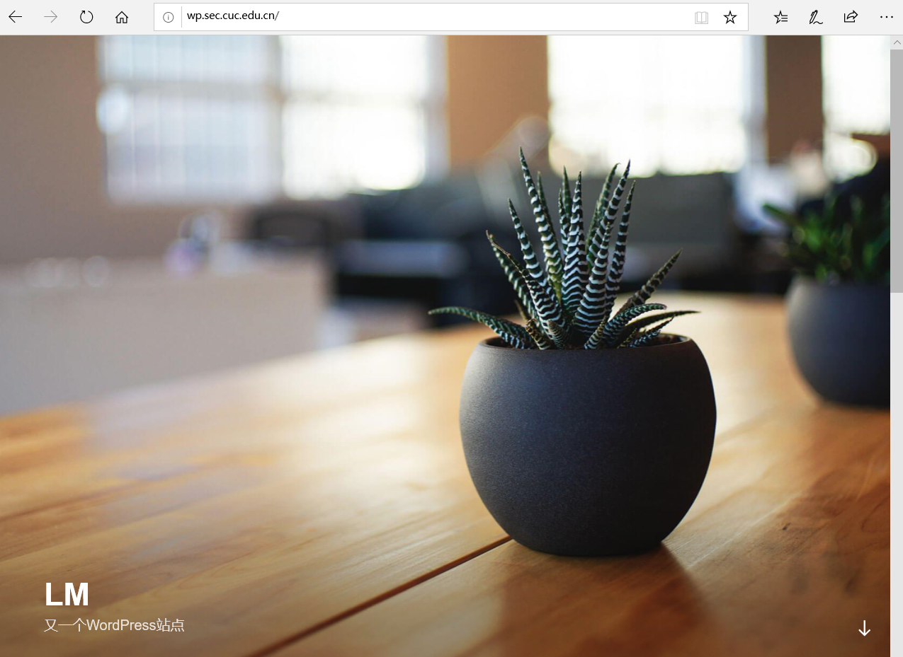

+ 在verynginx中配置访问wp.sec.cuc.edu.cn
	+ 添加Request Matcher
	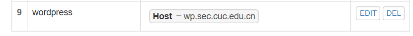
	+ 添加Up Stream节点
	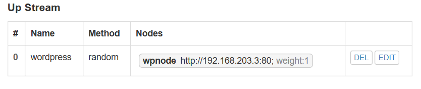
	+ 添加代理通行证 
	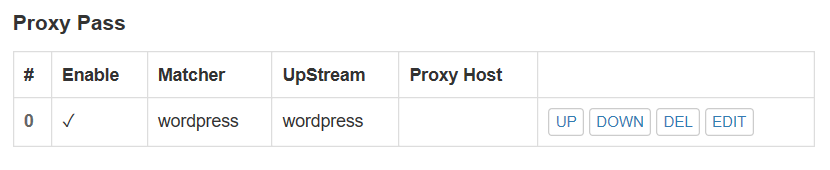
---
### 安装DVWA
+ 下载安装包
	```
	#先删除/var/www/下的默认文件index.html
	rm -r /var/www/html/index.html

	#git到本地
	git clone https://github.com/ethicalhack3r/DVWA /tmp/DVWA

	#移动到指定路径
	rsync -avP /tmp/DVWA/ /var/www/html/dvwa.sec.cuc.edu.cn

	```

+ 配置数据库   
建立数据库dvwa
	```mysql
	mysql> create database dvwa;
	mysql> grant all on dvwa.* to dvwa@localhost identified by 'STRONGP@SSW0rd';
	mysql> flush privileges;
	mysql> quit
	```
	更改DVWA配置文件中数据库相关数据
	```
	#将数据库名、用户名、密码改为之前设立的
	...
	$_DVWA[ 'db_server' ] = '127.0.0.1';
	$_DVWA[ 'db_database' ] = 'dvwa';
	$_DVWA[ 'db_user' ] = 'dvwa';
	$_DVWA[ 'db_password' ] = 'STRONGP@SSW0rd';
	...
	```

+ 更改PHP配置文件   
	```
	#重命名配置文件
	cp /var/www/html/dvwa.sec.cuc.edu.cn/config/config.inc.php.dist /var/www/html/dvwa.sec.cuc.edu.cn/config/config.inc.php

	#编辑配置文件
	vim /var/www/html/dvwa.sec.cuc.edu.cn/config/config.inc.php

	#修改如下内容
	allow_url_include = on
	allow_url_fopen = on
	display_errors = off 

	#重启PHP服务
	sudo systemctl restart php7.2-fpm

	#将所有权分配给www-data用户和组
	sudo chown -R www-data:www-data /var/www/html
	```

+ 新添Nginx配置文件/etc/nginx/sites-available/dvwa.sec.cuc.edu.cn  
这里使用端口8008
	```
	server {
			listen 8008;
			root /var/www/html/dvwa.sec.cuc.edu.cn;

			index index.php index.html index.htm index.nginx-debian.html;
			server_name 192.168.203.3;

			location / {
					try_files $uri $uri/ =404;
			}

			location ~ \.php$ {
					#PHP-FPM进程的反向代理配置在Nginx上
					include snippets/fastcgi-php.conf;
					fastcgi_pass unix:/var/run/php/php7.2-fpm.sock;
			}

			location ~ /\.ht {
					deny all;
			}
	}
	```
+ 创建软链接  
`sudo ln -s /etc/nginx/sites-available/dvwa.sec.cuc.edu.cn /etc/nginx/sites-enabled/`
+ 重启Nginx服务  
`sudo systemctl reload nginx`

+ 访问站点，通过默认用户名admin和密码password登录，页面如下（开始用微软浏览器访问一直无法访问，换了个浏览器就好了，不知道为什么...）
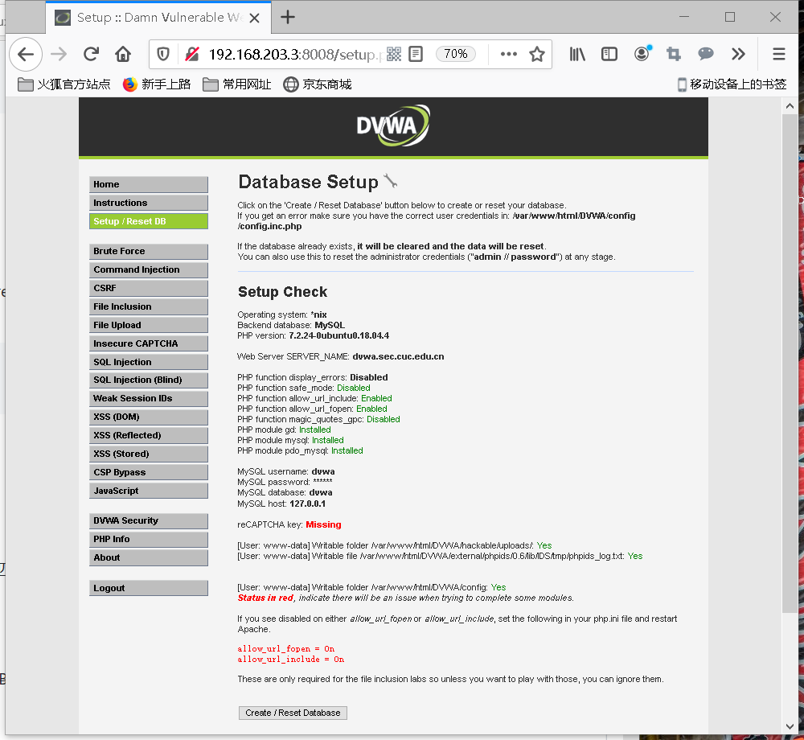

+ 在verynginx中配置访问dvwa.sec.cuc.edu.cn
	+ 添加Request Matcher
	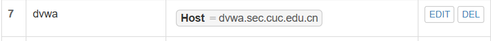
	+ 添加Up Stream节点
	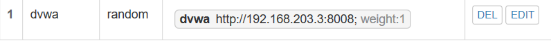
	+ 添加代理通行证 
	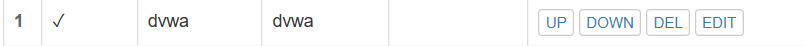
---
### 安全加固要求
+ 使用IP地址方式均无法访问上述任意站点，并向访客展示自定义的友好错误提示信息页面-1
    + 添加Request Matcher，使用正则表达式匹配ip地址
	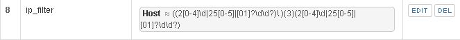
	+ 添加响应内容
	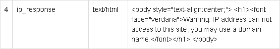
	+ 添加过滤器 
	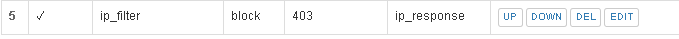
    + 测试结果
    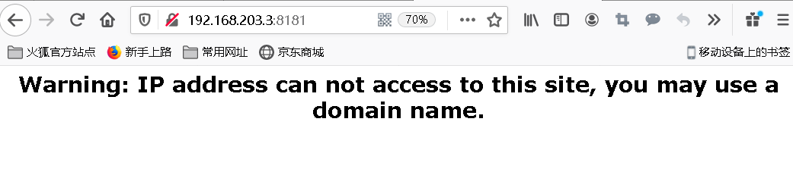
+ Damn Vulnerable Web Application (DVWA)只允许白名单上的访客来源IP，其他来源的IP访问均向访客展示自定义的友好错误提示信息页面-2
    + 添加Request Matcher，将白名单上的访客ip添加即可
	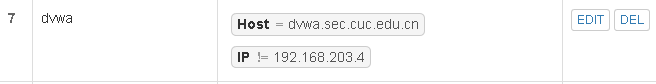
	+ 添加响应内容
	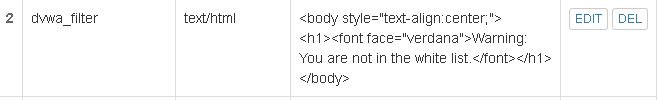
	+ 添加过滤器 
	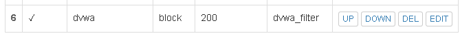
    + 非白名单访客访问测试结果
    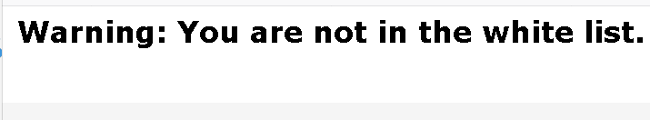
+ 在不升级Wordpress版本的情况下，通过定制VeryNginx的访问控制策略规则，热修复WordPress < 4.7.1 - Username Enumeration  
通过[Wordpress Username Enumeration 漏洞分析](https://paper.seebug.org/239/)可知，WordPress4.7版本的用户名枚举漏洞是攻击者可以在未授权状态下获取之前发布过文章的用户的用户名、id 等信息，对应路径是`/wp-json/wp/v2/users/`,因此只要阻止访问该页面就行了
    + 添加Request Matcher
	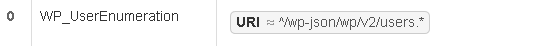
	+ 添加过滤器 
	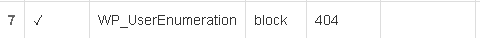
    + 访问测试结果
    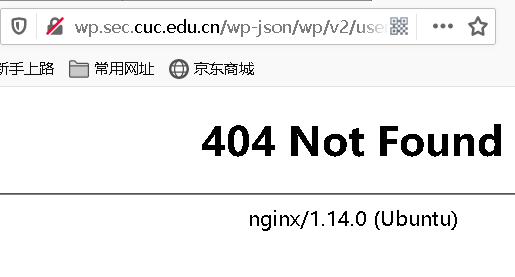
+ 通过配置VeryNginx的Filter规则实现对Damn Vulnerable Web Application (DVWA)的SQL注入实验在低安全等级条件下进行防护
    + 添加Request Matcher，过滤掉sql注入中的select、order by、union、count字段行为
	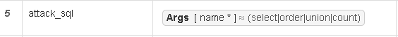
	+ 添加过滤器 
	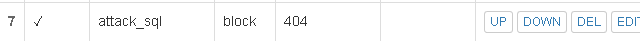
---
### VeryNginx配置要求
+ VeryNginx的Web管理页面仅允许白名单上的访客来源IP，其他来源的IP访问均向访客展示自定义的友好错误提示信息页面-3
    + 添加Request Matcher，将白名单上的访客ip添加即可（这里一定要将本机ip添加进去）
	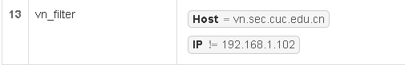
	+ 添加响应内容
	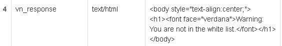
	+ 添加过滤器 
	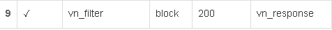
    + 非白名单访客访问测试结果同上

+ 通过定制VeryNginx的访问控制策略规则实现： 
	 + 限制DVWA站点的单IP访问速率为每秒请求数 < 50
	 + 限制Wordpress站点的单IP访问速率为每秒请求数 < 20
	 超过访问频率限制的请求直接返回自定义错误提示信息页面-4
     	+ 添加频率限制
		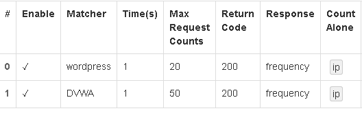
        
		+ 添加响应
		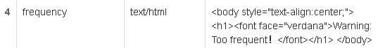

	 + 禁止curl访问
		+ 添加Request Matcher
	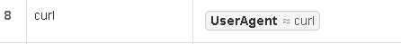
		+ 添加响应
	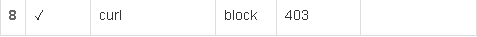
---
## 实验问题
+ 这次实验的基本状态就是：一杯茶一包烟（没有），一个bug卡一天。反正就是大大小小的坑没停过...不过踩坑也确实是能学到很多东西
+ 一开始执行apt update/install 的时候一直连接失败，或者报错`Release file for http://cn.archive.ubuntu.com/ubuntu/dists/bionic-updates/In`     
解决方法：查了一下[文档](https://www.cnblogs.com/outs/p/9706437.html)，说是系统时间不对导致的，执行`data`果然时间和现在不一样，应该是上次Systemd实验实操时改了的
+ 第一次下载WordPress压缩包的时候是在本机下载传过去的，解压时报了个小错但我没看见（唉，真的卡了我好久好久...），于是正常执行操作，最后WordPress站点无法打开        
解决方法：重新在虚拟机内wget下载WordPress压缩包，成功解压后执行操作。怎么说呢，以后做实验一点要非常仔细
+ 在VeryNginx中配置Web管理页面仅允许白名单上的访客来源IP时，这里做的时候特意想到了要把本机ip加进去，但是好像ip地址打错了所以成功入坑了     
解决方法：查看[文档](https://www.cnblogs.com/sanduzxcvbnm/p/11400349.html)说VeryNginx配置会保存在/opt/verynginx/verynginx/config/config.json中，于是去修改一下ip地址
+ 各种80端口让我脑海里一直循环范冰冰的rap“80 什么是80...”

---
## 实验参考
+ https://github.com/CUCCS/linux-2020-AM00zero/blob/chap0x05/chap0x05
+ [verynginx中文文档](https://github.com/alexazhou/VeryNginx/blob/master/readme_zh.md)
+ [在ubuntu18.04上配备LEMP环境](https://www.digitalocean.com/community/tutorials/how-to-install-linux-nginx-mysql-php-lemp-stack-ubuntu-18-04)
+ [在ubuntu18.04上基于LEMP下载wordpress](https://www.digitalocean.com/community/tutorials/how-to-install-wordpress-with-lemp-on-ubuntu-18-04)
+ [在ubuntu18.04上下载并配置DVWA](https://kifarunix.com/how-to-setup-damn-vulnerable-web-app-lab-on-ubuntu-18-04-server/)


