# 第六章：shell脚本编程练习进阶

## 实验要求
+ - [x] shell脚本编程基本要求
+ FTP
    - [x] 配置一个提供匿名访问的FTP服务器，匿名访问者可以访问1个目录且仅拥有该目录及其所有子目录的只读访问权限；
    - [x] 配置一个支持用户名和密码方式访问的账号，该账号继承匿名访问者所有权限，且拥有对另1个独立目录及其子目录完整读写（包括创建目录、修改文件、删除文件等）权限； 
    - [x] FTP用户不能越权访问指定目录之外的任意其他目录和文件；
    - [x] 匿名访问权限仅限白名单IP来源用户访问，禁止白名单IP以外的访问；
+ NFS
    - [x]  在1台Linux上配置NFS服务，另1台电脑上配置NFS客户端挂载2个权限不同的共享目录，分别对应只读访问和读写访问权限；
    - [x]  实验报告中记录在NFS客户端上看到的： 
      + 共享目录中文件、子目录的属主、权限信息
      + 通过NFS客户端在NFS共享目录中新建的目录、创建的文件的属主、权限信息
      + 上述共享目录中文件、子目录的属主、权限信息和在NFS服务器端上查看到的信息一样吗？无论是否一致，请给出你查到的资料是如何讲解NFS目录中的属主和属主组信息应该如何正确解读
+ DHCP 
    - [x] 2台虚拟机使用Internal网络模式连接，其中一台虚拟机上配置DHCP服务，另一台服务器作为DHCP客户端，从该DHCP服务器获取网络地址配置

+ Samba
    - [x] smbclient
        + Linux访问Windows的匿名共享目录
        + Linux访问Windows的用户名密码方式共享目录
        + 下载整个目录

+ DNS  
完成手动配置

---
## 实验环境
+ ubuntu18.04
+ vitrualbox
+ 工作主机（ubuntu1@cuc）
   host-only ip:192.168.203.4
+ 目标主机（ubuntu1@ansible_slave）
  host-only ip：192.168.203.3
---
## 实验内容
### 配置远程目标主机的SSH免密root登录
+ 在工作主机生成ssh-key
  ```
  ssh-keygen -t rsa
   #然后一直按回车键，就会按照默认的选项将生成的密钥保存在.ssh/id_rsa文件中
  ```
+ 将生成的公钥拷贝到目标主机中  
`ssh-copy-id -i id_rsa.pub root@192.168.203.3`

+ 修改目标主机/etc/ssh/sshd_config配置文件
  ```
  # 设置可通过口令认证SSH
  PasswordAuthentication yes
  # 允许root用户登录
  PermitRootLogin yes
  ```
+ ssh免密root登录目标主机结果
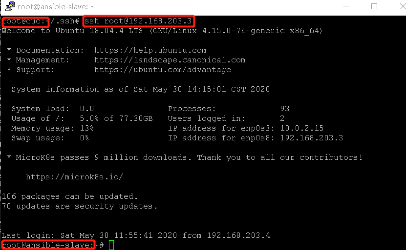

#### 参考资料
[Ubuntu 下 SSH 实现远程登录](https://blog.csdn.net/simonchi/article/details/39054437?utm_medium=distribute.pc_relevant.none-task-blog-BlogCommendFromMachineLearnPai2-1.nonecase&depth_1-utm_source=distribute.pc_relevant.none-task-blog-BlogCommendFromMachineLearnPai2-1.nonecase)

## FTP

#### 实验工具
+ vsftpd
+ 选择原因：高性能且高安全性

#### 实验过程(具体的脚本运行过程在脚本中均做了注释)
+ 将编写好的脚本vsftpd.sh拷贝到目标主机运行
+ ssh连接目标主机运行脚本
+ 实验结果
  + 脚本运行结果
  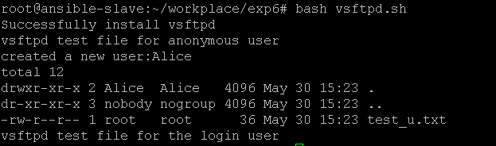
  +  配置一个提供匿名访问的FTP服务器，匿名访问者可以访问1个目录且仅拥有该目录及其所有子目录的只读访问权限
  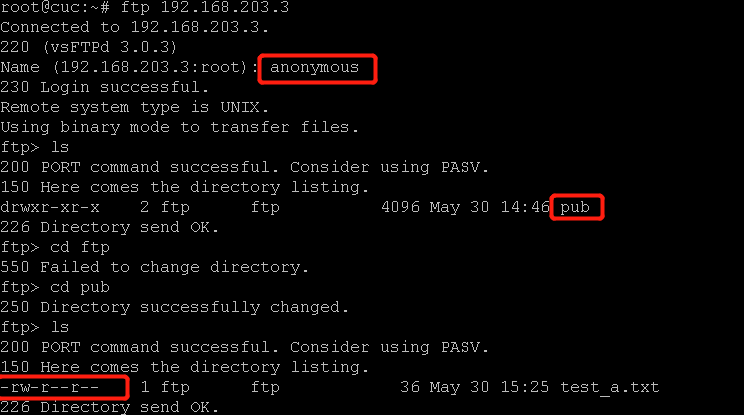
  + 配置一个支持用户名和密码方式访问的账号，该账号继承匿名访问者所有权限，且拥有对另1个独立目录及其子目录完整读写权限
  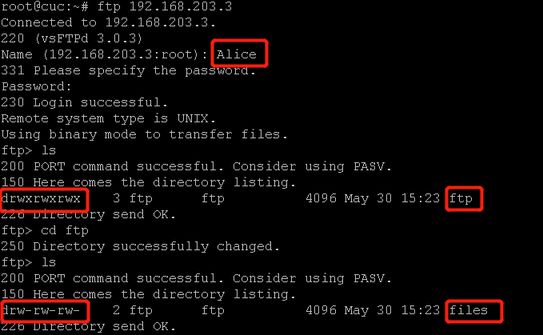
  + FTP用户不能越权访问指定目录之外的任意其他目录和文件
  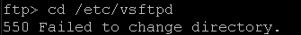
  + 匿名访问权限仅限白名单IP来源用户访问，禁止白名单IP以外的访问
  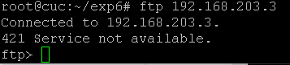

#### 实验参考
[Linux下FTP Server评估](https://www.cnblogs.com/zhaoyang-1989/articles/3453408.html)
[Ubuntu 16.04下vsftpd 安装配置实例](https://www.cnblogs.com/magic-chenyang/p/10383929.html)


## NFS

#### 实验过程
+ 将nfs_s.sh拷贝到目标主机（服务器）并运行
+ 在工作主机（客户端）运行nfs_c.sh

#### 实验结果
+ 服务器端查看只读访问权限的共享目录
  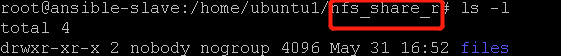
+ 服务器端查看读写访问权限的共享子目录
  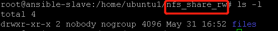
+ 客户端查看只读访问权限的共享目录
  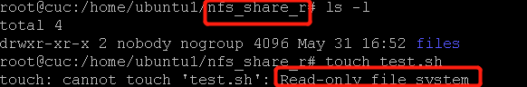
+ 客户端查看读写访问权限的共享子目录
    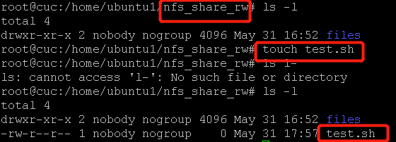
+ NFS目录中的属主和属主组信息应该如何正确解读  
由[关于NFS参数root_squash说明](http://www.360doc.com/content/14/0527/00/17617523_381280598.shtml)，root_squash是为客户端分配服务器访问权限时的参数，其分别表示：  
  + no_root_squash：登入 NFS 主机使用分享目录的使用者，如果是 root 的话，那么对于这个分享的目录来说，他就具有 root 的权限！这个项目『极不安全』，不建议使用！   
  + root_squash：在登入 NFS 主机使用分享之目录的使用者如果是 root 时，那么这个使用者的权限将被压缩成为匿名使用者，通常他的 UID 与 GID 都会变成 nobody 那个系统账号的身份。   


  我在脚本里编辑配置文件时没加这个参数，但由实验结果来看客户端看到的UID和GID是nobody和nogroup，所以这个参数默认应该是root_squash

#### 实验参考
+ [关于NFS参数root_squash说明](http://www.360doc.com/content/14/0527/00/17617523_381280598.shtml)
+ [Ubuntu 18.04 LTS上安装NFS服务器和客户端](https://www.cnblogs.com/aiMiku/p/12015818.html)

## DHCP
#### 实验过程
Server(目标主机)
+ 虚拟机网络设置中新增第三块网卡，将连接方式设置为Internal网络模式连接
+ 运行dhcp.sh

Client(工作主机)
+ 虚拟机网络设置中新增第三块网卡，将连接方式设置为Internal网络模式连接
+ 修改配置文件/etc/01-netcfg.yaml，添加以下内容
  ```
  enp0s9
    dhcp4: yes
  ```
+ 执行`sudo netplan apply`

#### 实验结果
+ 运行脚本前  
客户端enp0s9网卡未分配ip地址
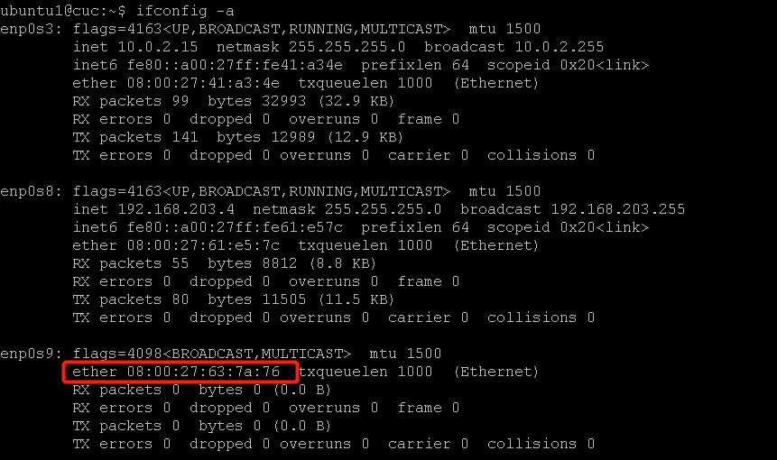
+ 运行脚本后   
客户端enp0s9网卡获取ip地址192.168.203.10
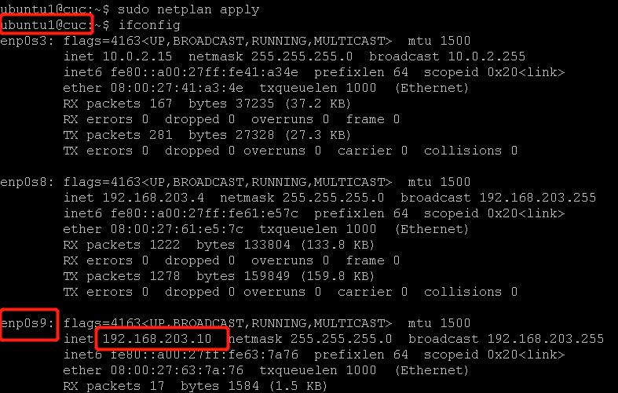

#### 参考
+ (Ubuntu LTS 18.04 配置DHCP Server)[https://blog.csdn.net/songyuequan/article/details/89437405]

#### 实验问题
+ 一开始将虚拟机的第一块网卡的连接方式由NAT改为内部网络，但是运行脚本的时候发现连不上网无法下载软件包  
解决方法：问了师哥说是内部网络模式是无法上网的，于是新增一块网卡将其以内部网络模式连接


## Samba
#### 实验过程
Windows端
+ 设置匿名用户共享目录
  + 右击要共享的文件-->  属性 --> 共享 --> 共享
  + 将Everyone添加到要共享的用户
  + 在网络和共享中心中设置无密码的保护
  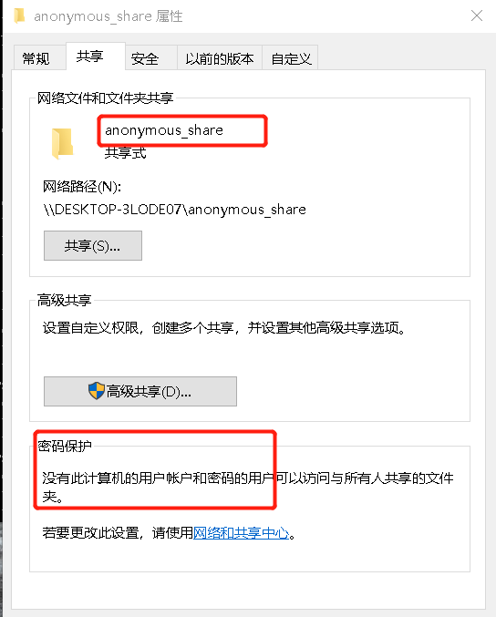
+ 设置用户名密码方式共享目录
  + 创建新用户Samba，设置密码
  + 右击要共享的文件-->  属性 --> 共享 --> 共享
  + 将新增的用户添加到要共享的用户
  + 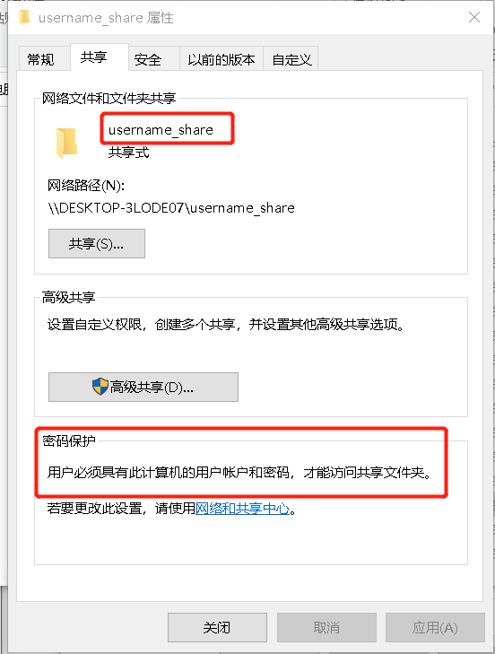

Linux端
+ 运行脚本Samba.sh

#### 实验结果
+ Linux访问并下载Windows的匿名共享目录
(1.txt为共享目录中的内容)
 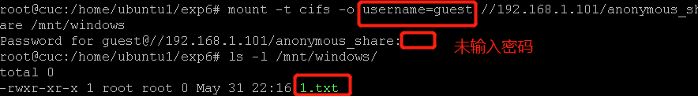
+ Linux访问并下载Windows的用户名密码方式共享目录   
(2.txt为共享目录中的内容)
 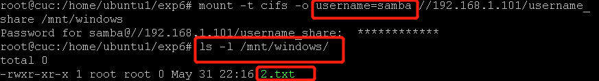

#### 参考
+ [Linux通过samba访问windows文件](https://blog.csdn.net/u012654882/article/details/47320805
)
+ [mount.cifs 中文手册](http://www.jinbuguo.com/man/mount.cifs.html)

#### 实验问题
+ 在进行匿名挂载时，按照网上说的执行`mount -t cifs -o guest `一直报错permission denied(这里卡了好久)，然后改成`mount -t cifs -o user=guest `输入密码时直接跳过，可以进行匿名挂载(网上没找到相关操作，也不知道这么做对不对...)

## DNS
手动配置

Server
+ 安装bind9
  `sudo apt-get install bind9`
+ 编辑配置文件/etc/bind/named.conf.options
  ```
  # 添加以下内容
  listen-on { 192.168.203.3; };
  allow-transfer { none; };
  forwarders {
      8.8.8.8;
      8.8.4.4;
  };
  ```
+ 编辑配置文件/etc/bind/named.conf.local 
  ```
  # 添加以下内容
  zone "cuc.edu.cn" {
      type master;
      file "/etc/bind/db.cuc.edu.cn";
  };
  ```

+ 生成配置文件db.cuc.edu.cn    
`sudo cp /etc/bind/db.local /etc/bind/db.cuc.edu.cn`

+ 编辑刚刚生成的配置文件db.cuc.edu.cn 
  ```
    ;
    ; BIND data file for local loopback interface
    ;
    $TTL    604800
    @       IN      SOA     cuc.edu.cn. root.cuc.edu.cn. (
                                  2         ; Serial
                            604800         ; Refresh
                              86400         ; Retry
                            2419200         ; Expire
                            604800 )       ; Negative Cache TTL
    ;
    ; name servers - NS records
        IN      NS      ns.cuc.edu.cn.
    ns      IN      A       192.168.203.3
    ;
    ; wp - A records
    wp.sec.cuc.edu.cn.      IN      A       192.168.203.3
    ;
    ; DVWA - CNAME records
    dvwa.sec.cuc.edu.cn.    IN      CNAME   wp.sec.cuc.edu.cn.
  ```
+ 重启DNS服务器  
  `sudo systemctl restart bind9.service`

Client
+ 安装resolvconf  
`sudo apt-get install resolvconf`
+ 编辑配置文件/etc/resolvconf/resolv.conf.d/head
  ```
      search host.cuc.edu.cn  # your private domain
      nameserver 192.168.203.3  # ns private IP address
  ```

#### 实验结果
+ 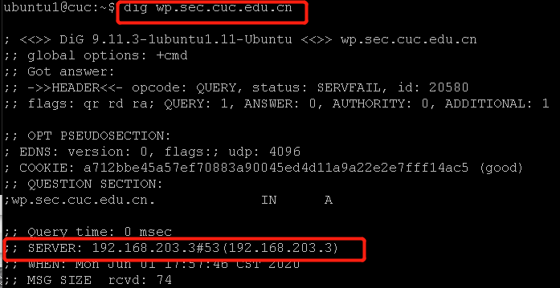
+ 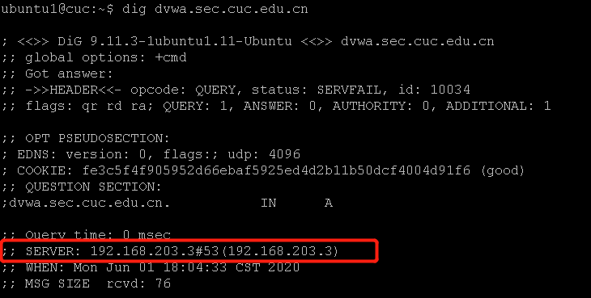
#### 实验参考
+ https://github.com/CUCCS/linux-2019-luyj/blob/Linux_exp0x06/Linux_exp0x06/Linux_exp0x06.md
+ [DNS Client Configuration](https://ubuntu.com/server/docs/network-configuration)


